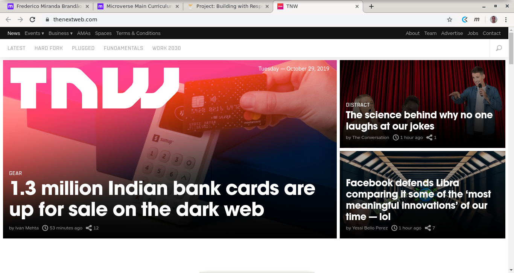
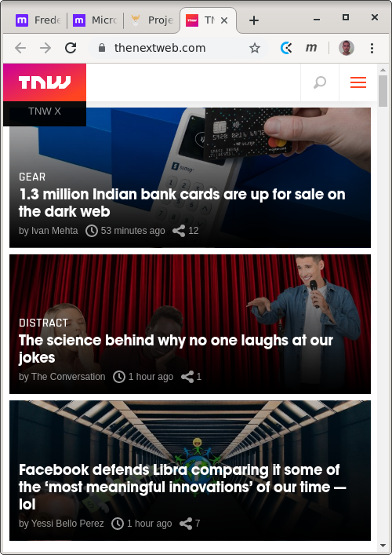
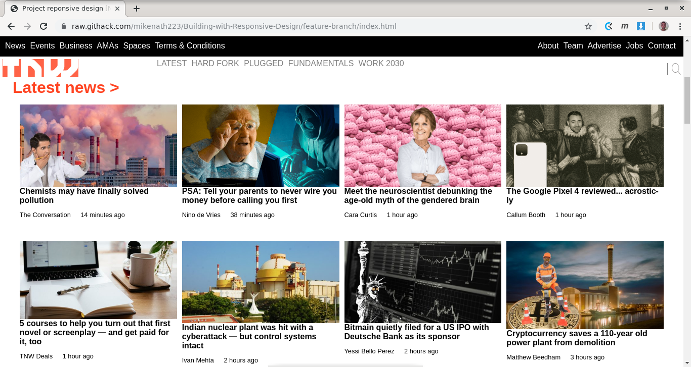
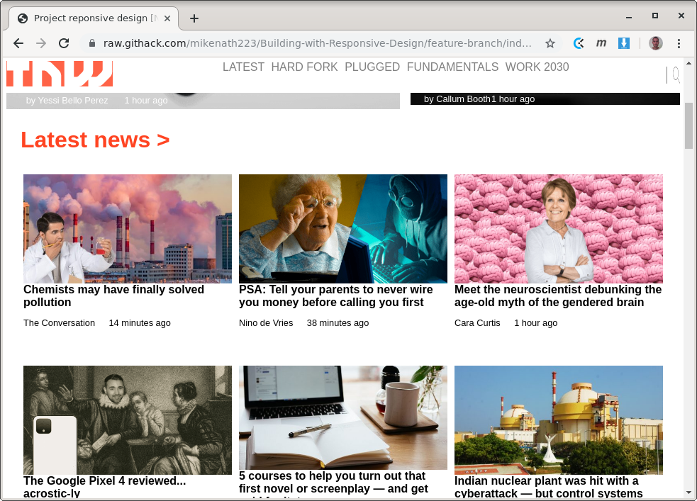
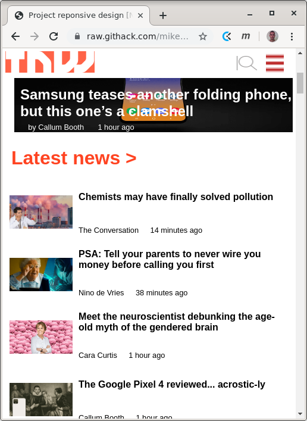

# RESPONSIVE WEB DESIGN

## AUTHORS

Ukeje Michgolden (https://github.com/mikenath223)
Frederico Miranda (https://github.com/frederico-miranda)

## ABOUT THIS PROJECT

This project is about creating a web page that follows the principles of _responsive web design_ by mimicking a web page (www.thenextweb.com) which does follow that principle. Responsive web pages are those that can change their own layout according to the needs of the visiting user. As an example, users visiting a web page from a mobile device (a tablet or a phone) might have a small screen area, which might not be enough to present the web page in the same way it would be presented to users visiting from a desktop device. A responsive web pages rearrange the contents of the page according to the device of the user (mobile device, desktop device, printers), as the example below:

## SCREENSHOTS & LIVE VERSION

### LIVE VERSION

(https://rawcdn.githack.com/mikenath223/Building-with-Responsive-Design/3f3f3ff41eeb6ff38a9793b34eaef830c703b323/index.html)

### SCREENSHOTS

